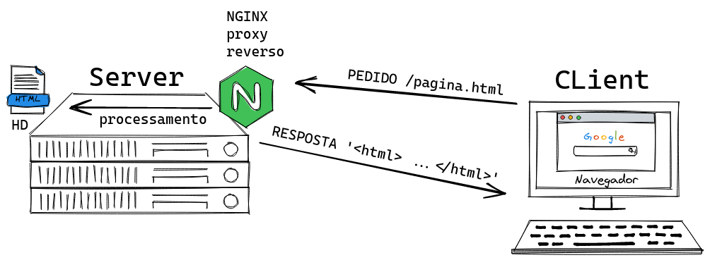
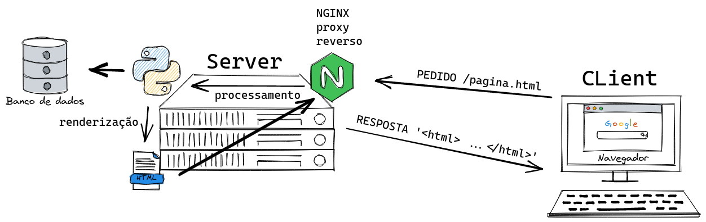
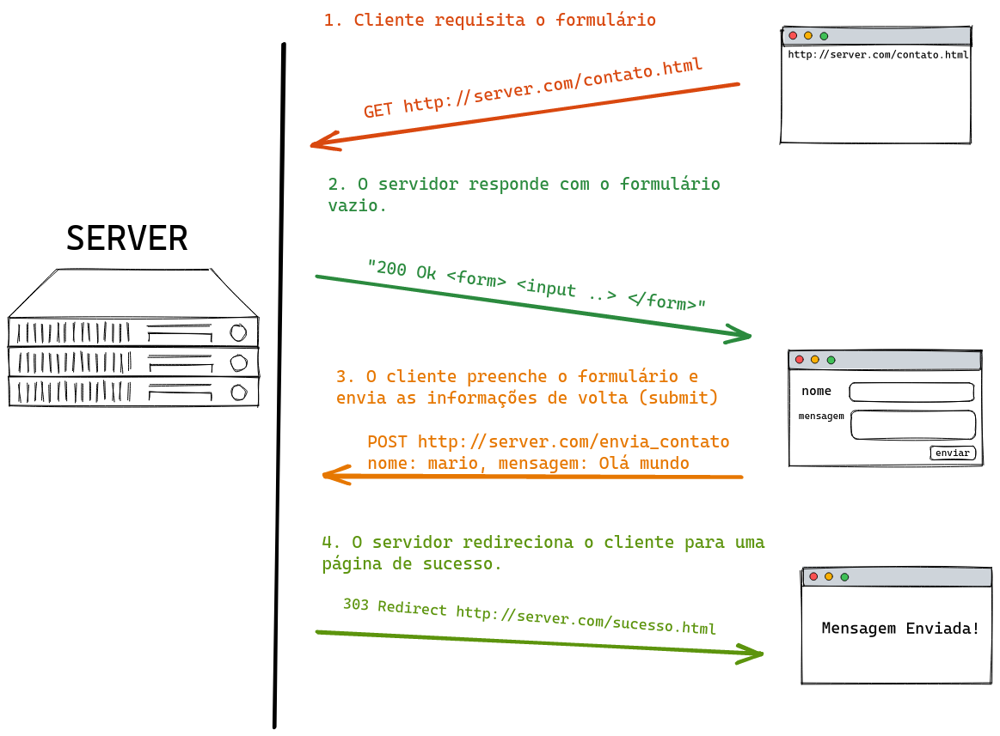

<center><h1>Python Web - Linux Tips<h1></center>

## Introdução

Anotações pessoais do curso Python Web API do Linux Tips. Este é um material de apoio. Existe ainda um material oficial das aulas no diretório ...

---
## Day 1

### 1 - Hypertexto e URL

Hipertexto é a forma textual de fazer referência a outros textos ou documentos. Nossos documentos de hipertexto (htmls) essencialmente fazem isso, além de conter as informações que constroem a página, eles também possuem referências a outroas páginas ou documentos através da tag \<a> (âncora) e outros atributos.

Para fazer referência a outros documentos ou textos, precisamos saber qual seus endereços. Ou seja, onde está localizado? O protocolo HTTP foi criado a princípio para definir como esses documentos de hipertexto seriam compartilhados. Nele temos a definição da URL (Uniform Resource Location) que nos indica o endereço dos documentos para fazermos referência.

O protocolo HTTP roda em uma camada acima do protocolo TCP. O TCP é um protocolo que define a comunicação, física e lógica, entre duas máquinas (rede). Portanto, o protocolo HTTP trafega dentro do TCP para enviar os documentos de hipertexto.

Anatomia da URL:


---

### 2 - HTML, CSS e Javascript

Aula com conteúdos apenas sobre html, css e js. Nenhuma novidade para ser anotado aqui.

---

### 3 - Cliente HTTP

Anteriormente usamos o protocolo File (file://local) para acessar nossa pagina.html. Isso só foi possível pq temos os arquivos em nossa máquina local. Acontece que na grande maioria das vezes esse não é o caso, e precisamos acessar servidores externos para obter essas páginas. Par isso usamos o protocolo HTTP.

O HTTP é um protocolo que roda em cima do TCP (protocolo para comunicação entre computadores e servidores). Quando digitamos "http" em nosso navegador, o mesmo cria um objeto de texto, também conhecido como "pedido", que contém o enrereço do recurso que estamos pedindo. Este texto é passado para o servidor alvo de onde estamos querendo o servidor. Geralmente esse servidor tem esses recursos em arquivos. O servidor precisa ter os recursos necessários para atender nossos pedidos. O recurso utilizado por esses servidores é chamado de "Web Server". Um web server é capaz de interceptar esse texto de pedido que enviamos e fazer várias verificações, se temos autorização, qual o recurso, onde está o recurso e etc. Ele então processa nosso pedido e faz a busca do mesmo. Quando o web server encontra o recurso, ele cria um outro objeto chamado de "resposta" e nos enviar o arquivo html. Um exemplo básico desse processo é mostrado abaixo.


Um exemplo web sever é o Nginx ("engine x") que utiliza um método chamado proxy reverso, que usada como intermediadora entre nossa requisição e o servidor, fazendo todas as tratativas para nos dedvolver uma resposta. Então o Nginx tanto processa nossos pedidos quanto monta nossa resposta. Vamos a partir de agora usar os termos "request" e "response".

O HTTP, portanto, trabalha com duas ações: request e response. Além dessas duas ações, o HTTP possui métodos, que são verbos ou palavras-chave que determinam a natureza da ação que o cliente deseja executar no servidor.
- Get: O cliente quer pegar um arquivo do servidor;
- POST: O cliente quer enviar um arquivo para o servidor;
- PUT ou PATCH: O cliente quer alerar um arquivo que está no servidor;
- DELETE: O cliente quer apagar um arquivo que está no servidor.

Resumindo então, sabemos que o servidor possui uma porta TCP (socket) sempre aberta esperando uma requisição. Enviamos uma requisição através do HTTP, ou seja, um objeto request que nada mais é que um texto, contendo as informações que desejamos. Esse request possui um método que descreve a natureza do nosso pedido (como já descrito acima). O web server do lado do servidor vai receber nosso request, processá-lo e montar o objeto response. Um exemplo de texto que o navegador envia como request abaixo.
 ```bash
GET /pagina.html
User-Agent: Firefox/100
Accept: */*
 ```
### 4 - Server Side Rendering

Na conexão Cliente Servidor tradicional, passamos pela URL o arquivo que queremos para o servidor e obtemos acesso diretamente a ele. Quando usamos uma linguagem de programação como o python no servidos, como fizemos no arquiv ssr.py, nós não temos um html no servidor, mas sim um template construído no python que executa um html e seus placecholders. O seu script python pode, por exemplo, consultar um banco de dados, preencher os template do html e enviar para o cliente um html já preenchido. Ou seja, ele faz a renderização no server e envia o html.


 

 ### Blog

 No pasta "blog" foi criado uma estrutura server side rendering para criarmos um blog.

 ### 5 - Preenchimento de Forms usando GET e POST

 Geralmente essa operação possui alguns passos, como descritos abaixo e apresentado na imagem:

- 1 - Cliente solicita via GET um formulário vazio para o servidor
- 2 - Servidor responde renderizando um form vazio
- 3 - Cliente preenche o form e envia, via POST, as informações preenchidas
- 4 - Servidor faz as operações necessárias com as informações (valida, salva no banco etc) e redireciona cliente para uma página de sucesso
 
 

 O CGI (Commons Gatway Interface) é um protocolo que habilita o método POST no navegador. Esse protocolo serve de base para vários outros em outras linguagens (WSGI, ASGI etc). Para usar o CGI, precisamos ter uma pasta na raiz com o nome "cgi-bin". Nela criamos os scripts responsáveis por interceptar os dados do post.

 ### WSGI

 É um padrão criado para o python (cada linguagem tem seu padrão) criado para definir a comunicação entre web services (nginx, apache etc) e os frameworkd (fastapi, flask, django etc). Independente do framework ou webserver utilizado, o WSGI será a interface entre eles definindo as regras de comunicação. Isso permite o uso e criação de vários frameworks no mercado.

 O WSG exige que criamos um objeto callable. Também exige que o callable receba como parâmetro o environment e a função de callback (start_response). Exige também que o retorno seja iterável.

 Um ponto que deve ser sempre levantado é a necessidade de implementar o serviço de uma maneira que suporte multiplas requiseções "ao mesmo tempo"...